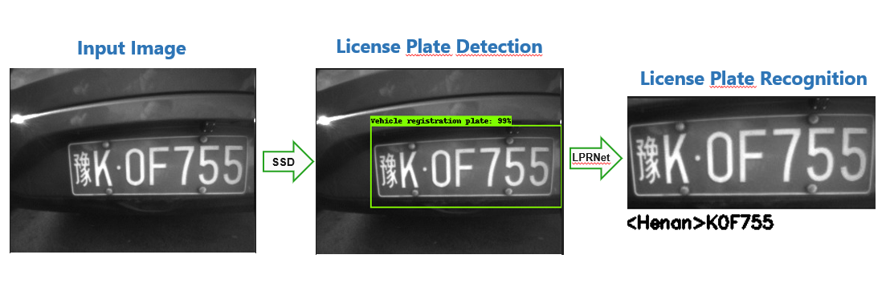
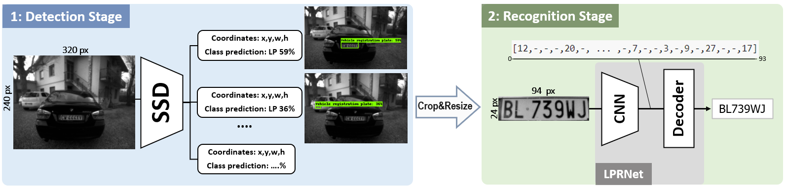
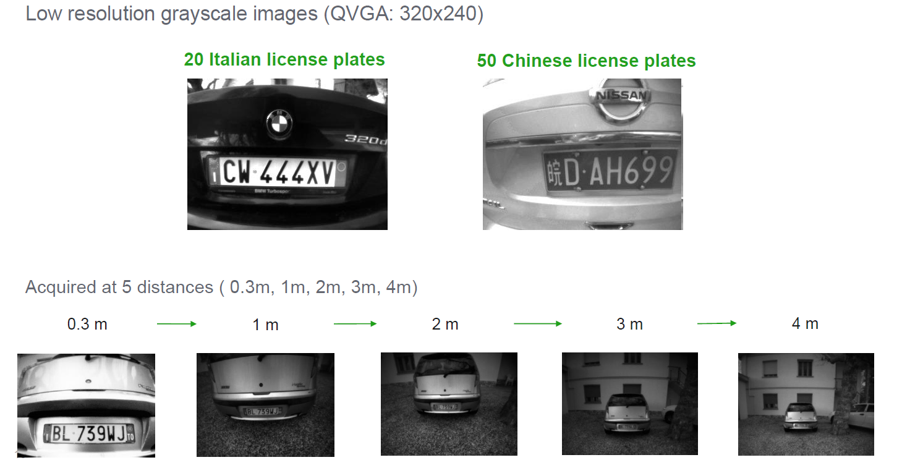

# Low-Power License Plate Detection and Recognition on a RISC-V Multi-Core MCU-based Vision System (ISCAS2021) ([Paper](https://ieeexplore.ieee.org/document/9401730))

        
*Copyright (C) 2021 GreenWaves Technologies &  Alma Mater Studiorum Bologna. All rights reserved.*

**Authors:** *Lorenzo Lamberti* *(<lorenzo.lamberti@unibo.it>)*,
        *Manuele Rusci*,
        *Marco Fariselli*,
        *Francesco Paci*,
        *Luca Benini*.
        
~~~~
@INPROCEEDINGS{lamberti2021lowpowerocrISCAS,
  author={Lamberti, Lorenzo and Rusci, Manuele and Fariselli, Marco and Paci, Francesco and Benini, Luca},
  booktitle={2021 IEEE International Symposium on Circuits and Systems (ISCAS)}, 
  title={Low-Power License Plate Detection and Recognition on a RISC-V Multi-Core MCU-Based Vision System}, 
  year={2021},
  volume={},
  number={},
  pages={1-5},
  doi={10.1109/ISCAS51556.2021.9401730}}
~~~~


### ISCAS 2021 Presentation [Video](http://www.youtube.com/watch?v=Y-ov2i0wuTA)


<!-- [](http://www.youtube.com/watch?v=Y-ov2i0wuTA "YouTube Link") -->


# License Plate Detection and Text Recognition on GAP 


This is a two stage lightweight and robust license plate recognition based on SSD and LPRNet and implemented Tensorflow.
SSD is a very well-known real-time single-step object detector model and it is trained for license plate detection. 
LPRNet, another real-time end-to-end DNN, is utilized for the subsquent recognition. 
This network is attributed by its superior performance with low computational cost without preliminary character segmentation. 
It's an interesting approach that performs character recognition without any use of RNNs (just a CNN + a decoder).
Here is the illustration of the proposed pipeline:



## Two step ALPR Pipeline breakdown:



## Performances on GAP8


|                       | Algorithm |   Dataset    | Input size | # Parameters | MAC operations | Inference Time @ 175MHz |   Accuracy    |
| :-------------------: | :-------: | :----------: | :--------: | :----------: | :------------: | :---------------------: | :-----------: |
|  **1. LP Detection**  |    SSD    | OpenImagesV4 | 320x240 px |    3.1 M     |     515 M      |    0.557s (1.73 FPS)    |   mAP 38.9%   |
| **2. LP Recognition** |  LPRNet   | CCPD, Czech  |  94x24 px  |    1.0 M     |     172 M      |    0.343s (1.62 FPS)    | LP-RR >99.13% |


|                             |  Algorithm   | # Parameters | MACs  | Inference Time @ 175MHz | Av. Power | Energy-per-inference |
| :-------------------------: | :----------: | :----------: | :---: | :---------------------: | :-------: | :------------------: |
| **Detection + Recognition** | SSD + LPRNet |    4.1 M     | 687 M |    0.92s (1.09 FPS)     |  117 mW   |        108mJ         |


## Validation Datasets

I acquired 2 little validation datasets with the himax camera and GAP. There are about 50 chinese plates and 20 italian ones.
<!-- - [Italian License Plates](./Licence-plate-recognition/dataset/my_dataset)
- [Chinese License Plates](./Licence-plate-recognition/dataset/my_dataset_china) -->

I took pictures increasing distances (0-4 meters) as explaned in the following picture:




## In depth explanation of each step

The approach is divided into 2 steps: detection of the plate and recogition of the text.

The scripts to perform each step are separated into the two folders "lp_recognition" and "lp_detection". 

An in-depth explanation is provided in order to use these two algorithms properly:

- [License Plate Detection](lp_detection/README.md)
- [License Plate Recognition](lp_recognition/README.md)

The [Jupyter Notebook Tutorial](license-plate-ocr-tutorial.ipynb) unifies both steps in a full pipeline.

The code is based on two gibhub repositories, check them to have more information:
- [Tensorflow API for Object Detection](https://github.com/tensorflow/models/tree/master/research/object_detection)
- [Intel Openvino training extension - License Plate Recognition](https://github.com/openvinotoolkit/training_extensions/tree/develop/misc/tensorflow_toolkit/lpr)

## Submodules setup
Make sure to clone recoursively (so that submodules are downloaded) and to switch to older compatible commits of the submodules (tested and working)

```
git clone --recursive git@iis-git.ee.ethz.ch:lorenzo.lamberti/license-plates-ocr.git
cd external/tensorflow-api
git reset --hard 4ae295c35f5d5f663f8aef2d5da079a02908da76
cd /external/LPRNet
git reset --hard c4aefe109af9c7c1be8e761094e97d24ab752583
```

Fix the proto file missing from tensorflow object detection API

```
cd external/tensorflow-api/research
protoc object_detection/protos/*.proto --python_out=.
```

Install Python COCO API:

```
cd external/
git clone https://github.com/cocodataset/cocoapi.git
cd cocoapi/PythonAPI
make
cp -r pycocotools/ ../../tensorflow-api/research/
```


## Setup
Download my pretrained models for both recognition and detection in my [Google Drive](https://drive.google.com/open?id=1LCI-aRiPJ1Ez3BEYVcF8zVXTe4isMNbG) .

create the three conda environment that are needed for running the scripts:
```
cd lp_detection/
conda env create -f environment_tensorflow1.15. yml
conda env create -f environment_tensorflow2.1. yml
cd lp_recognition/
conda env create -f environment_lprnet. yml
```

You can read more about how to set up the environment from the tensorflow API and LPRNet repositories
(TF1.15 recommended):
- [Tensorflow API for Object Detection](https://github.com/tensorflow/models/tree/master/research/object_detection)
- [Intel Openvino training extension - License Plate Recognition](https://github.com/openvinotoolkit/training_extensions/tree/develop/misc/tensorflow_toolkit/lpr)

the testing script of detection works also with TF2, everything else with TF1.15


<!-- ## Related work on Parallel-Ultra-Low-Power TinyML: -->
