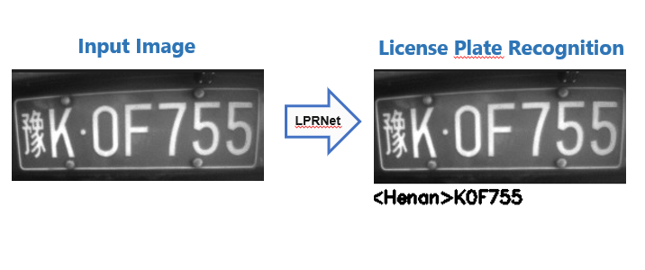
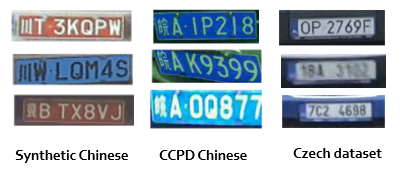

# How to use LPRNet for License Plate Recognition

Take a look at the git repo [Openvino Tensorflow Toolkit for License Plate Recognition](https://github.com/opencv/openvino_training_extensions/tree/develop/tensorflow_toolkit/lpr) to set up the environment and to go through the basic tutorials.

Take a look at the [Intel website](https://software.intel.com/content/www/us/en/develop/download/license-plate-recognition-using-lprnet-model.html) to have more insights.


## What is LPRNet 

- LPRNet is a real-time framework for high-quality license plate recognition supporting template and character independent variable-length license plates, performing LPR without character pre-segmentation, trainable end-to-end from scratch for different national license plates.

- LPRNet is the first real-time approach that does not use Recurrent Neural Networks and is light in weight enough to run on variety of platforms, including embedded devices.

- Application of LPRNet to real traffic surveillance video shows that our approach is robust enough to handle difficult cases, such as perspective and camera-dependent distortions, hard lighting conditions, change of viewpoint, and so on.

<center>

</center>

### Training Dataset

Here's a list of useful training datasets that could be useful in order to train the algorithm for license plate recognition
Obs: To train the algorithm only the chatacter annotation (without position) is needed (segmentation-free).

  - [Synthetic Chinese License Plates](https://github.com/opencv/openvino_training_extensions/tree/develop/tensorflow_toolkit/lpr) (270k images) segmentation-free
  - [CCPD: real Chinese License Plates](https://github.com/detectRecog/CCPD) (200k images) segmentation-free
  - [Czech Low-Quality License Plates](https://medusa.fit.vutbr.cz/traffic/research-topics/general-traffic-analysis/holistic-recognition-of-low-quality-license-plates-by-cnn-using-track-annotated-data-iwt4s-avss-2017/) (185k images) segmentation-free
  - [UFPR-ALPR Brazillian License Plates](https://web.inf.ufpr.br/vri/databases/ufpr-alpr/) (4.5k images) segmentation level annotations

**Example images:**

 

### Annotation files format

LPRNet doesn't use tfrecords. It only needs one (or multiple) folders with the images inside and a `.txt` file that contains the location of the images and their annotation. For the testing/evaluation scripts we need both informations: location and GT chatacter annotations. For the Testing script we just need the location of the images (no accuracy score is generated). This file is structured as follows:

**Training and Evaluation annotation.txt files:**
- one row for each image
- each row is composed of the path to the image and the GT characters of the plate

``` path_to_the/image.jpg CW123AA ```

**Testing annotation.txt file:**

- one row for each image
- each row is composed just of the path to the image

``` path_to_the/image.jpg  ```

###  Workspace


```
lp_recognition
  ├── config/  (where all the config files are)
  ├── frozen_graph/ (where frozen graphs are exported)
  ├── model/ (where training checkpoints are saved)
  ├── pre-trained/ (here i save final .ckpt file of the trained models)
  ├── utils/ (utilities to manipulate/create annotations of images)
  ├── environment_lprnet.yml
  ├── eval_lpr.py (evaluation = test on images and return accuracy)
  ├── export_frozen_graph.py 
  ├── infer_frozen_graph_single_image.py (test if .pb frozen graph works)
  ├── infer_tflite_single_image.py (test if tflite model works)
  ├── test_lpr.py (script for testing = generation of image with characters on it)
  └── train_lpr.py (script for training)
```

- **train_lpr.py** : to train the model. saves .ckpt and tensorboard files in `model/` directory.
  
- **test_lpr.py**: this testing script takes a pretrained model from `pre-trained/` directory, perform inference on a testing dataset and finally generates images with predictions superimposed. No accuracy measures are generated with this script.
  
- **eval_lpr.py**: this evaluation script  takes a pretrained model from `pre-trained/` directory, perform inference on an evaluation dataset and finally generates an accuracy measure. No images are generated with this script.

- **utils/** : 
  - **create_files_list.py:** used to create a .txt file of annotations for test_lpr.py script (only annotation of the path of the images, no GT character information). 
  - **update_annotations.py:** useful to open an annotation file of LPRNet and change the location of the images (usually when you change the path of the images folder)
  - **CCPD_cropping_plates/** : takes annotations of the CCPD dataset and use them to crop the images on the license plates and generates a new annotation file in the LPRNet format
  - **czech_convert_annotations/** : takes annotations of the Czech dataset and generates a new annotation file in the LPRNet format

- **frozen_graph/** : this folder will contain the frozen graph exported by "export_frozen_graph.py" script. I use this same folder to store tflite models.


### Configuration file

How to setup the config/config_file.py file. 
 
- `input_shape = (24, 94, 3)` : sets the input file shape in  (height, width, channels) format
  
- `use_h_concat`: if True treats all the Chinese hieroglyphs (province names as  沪, 京) as a single big class
  
- `use_oi_concat` : if true treats O/0  and I/1 as a single class
  
- `max_lp_length` : max number of characters in license plates (should be at least twice the number of chars in the license plate)
  
- `rnn_cells_num` : misleading variable name. Sets the depth of the fully connected layers of the networks. It has nothing to di with Recurrent Neural Networks. *Spicy*

- `symmetric_range` : if true transforms input image pixels in the [-1,1] range. if False keeps the range in [0,1]

- `convert_to_gray`: preprocess the images and converts them to grayscale 3 hannels (works for all scripts: train, eval and test)

- `quantization_aware` : enables quantization aware training 8 bits

- `lpr_patterns`: defines possible license plate patterns with regular expressions. It does not have any influence on training or testing, doesn't force the predictions! it only affects the accuracy: if a prediction doesnt respect one of these patterns, then it is wrong anche single characters are not checked

- `model_dir` : folder where checkpoint of training will be saved

- `train` : training parameters for train_lpr.py script

- `eval` : training parameters for eval_lpr.py script

- `infer` : training parameters for test_lpr.py script
  - `output_dir` : where output images will be saved (test_lpr.py script)

- `file_list_path`: path to the annotations file

- `checkpoint`: path to ckeckpoint to load for test_lpr.py and eval_lpr.py scripts
- 
### Metrics

We use LP-RR (License Plate Recognition Rate) as metric, defined as:

$ LP-RR = \frac{Correct\ license\ plates}{Total\ n°\ of\ License\ Plates} $

A license plate is correct if all the characters are correctly recognized. Just one character mistaken means wrong recognition:


### TensorBoard

To visualize the training history (loss, learning rate) use [TensorBoard](https://www.tensorflow.org/tensorboard). Look [here](https://tensorflow-object-detection-api-tutorial.readthedocs.io/en/latest/training.html#tensorboard-sec) to install it.

First, change you directory to the training folder (`model/`) and lunch a session  with this command:
```tensorboard --logdir .'```

Then open firefox and copy the http address that pops up. You will see:

- **learning_rate**: how the learning rate decays with steps
- **loss**: is the training loss
- **optimization_loss**: same as "loss", is the training loss


### Quatization
You need to quantize your model for deploying it on GAP8.

Make shure you trained a model with quantization active: `quantization_aware=True` in the config file.

Then run these commands to quantize and generate a tflite file:

```
python export_frozen_graph.py config/xxx.py --output_dir frozen_graph_60000 --checkpoint ./training/model/model.ckpt-60000.ckpt
mv graph.pb.frozen graph.pb #rename
tflite_convert --graph_def_file=graph.pb --output_file=graph.tflite --input_arrays=input --output_arrays=Squeeze --inference_type=QUANTIZED_UINT8 --mean_values=128 --std_dev_values=127
``` 
